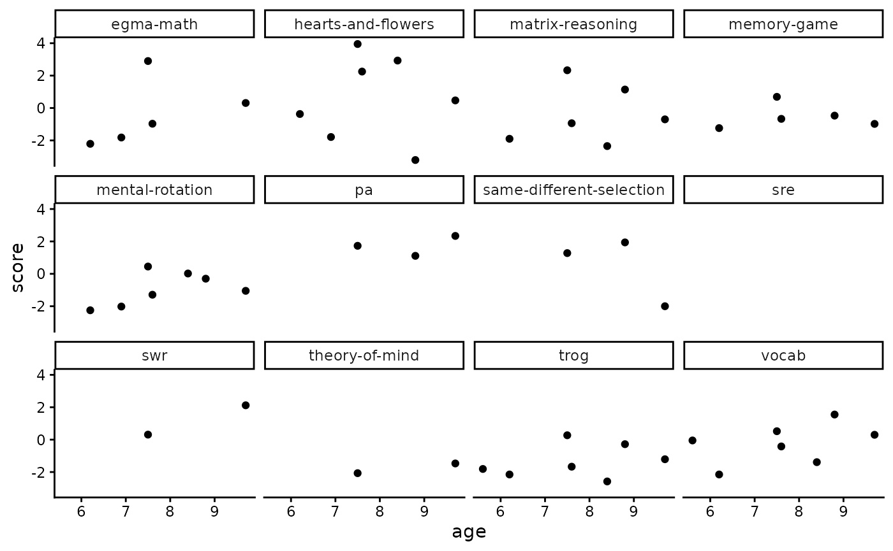

# levante package walkthrough

Before you begin this user walkthrough, please see the [package
README](https://levante-framework.github.io/levante-r/index.html) for 1)
how to install the `levante` R package and 2) how to gain access to the
data.

This walkthrough uses an example dataset of 15 participants
(levante-data-example) for teaching purposes. Access to the example
dataset requires creating an account and joining the LEVANTE
organization on Redivis, a data-sharing platform. For more information,
see our [Researcher Site page on Data
Access](https://researcher.levante-network.org/data).

## From Redivis to R

Permission to access the data is granted via
[Redivis](https://redivis.com/), a data-sharing platform used for all
LEVANTE datasets. Public releases of LEVANTE datasets on Redivis include
at least four tables: participants, scores, surveys, and trials.

**Table 1.** Redivis tables commonly read into data frames by `levante`

[TABLE]

## Using the `levante` package to load LEVANTE data

Each table from Redivis can be read into R as a data frame using a
specific `levante` `get_()` function. Each `get_()` function takes at
least two arguments, including a dataset name (required) and version
number (defaults to the current version unless otherwise specified).

First, load `levante` and other packages, as needed.

``` r

library(levante)
#> LEVANTE measures are covered under a CC-BY-NC-SA 4.0 license (https://creativecommons.org/licenses/by-nc-sa/4.0/deed.en). Measures adapted from the Rapid Online Assessment of Reading (Language Sounds, Sentence Reading, Word Reading) are covered under a Stanford Academic License (https://github.com/yeatmanlab/roar-mp/blob/main/LICENSE).
```

``` r

library(dplyr)
library(ggplot2)
theme_set(theme_classic())
```

Then, use
[`get_participants()`](https://levante-framework.github.io/levante-r/reference/get_participants.md)
to obtain child participant ids, approximate birthdates, and any
associated caregiver or teacher ids.

[`get_participants()`](https://levante-framework.github.io/levante-r/reference/get_participants.md)
is the first `levante` function in this code. When you run it, you’ll be
prompted to authenticate with a pop-up browser on Redivis (an academic
database manager that we use at LEVANTE) to ensure that you have the
right permissions to access the dataset. Subsequent `levante` calls to
this dataset within the same session should not require additional
authentication.

``` r

# Pull participant data from Redivis and save it to a data frame called "participants"
participants <- get_participants(data_source = "levante-data-example:d0rt", version = "current") 
#> Fetching data for levante-data-example:d0rt
#> --Fetching table participants

# Now let's do some preliminary checks on the participants data
participants |> count(dataset, sort = TRUE) # returns the number of participants from each dataset — the levante-data-example and private dataset data releases only contain data from a single dataset, but the public data releases contain multiple datasets stapled together
#> # A tibble: 1 × 2
#>   dataset                   n
#>   <chr>                 <int>
#> 1 pilot_western_ca_main     8
```

Use
[`get_scores()`](https://levante-framework.github.io/levante-r/reference/get_scores.md)
to obtain scored cognitive task data.

``` r

# Pull scored data from Redivis and save it to a data frame called "scores"
scores <- get_scores(data_source = "levante-data-example:d0rt", version = "current")
#> Fetching data for levante-data-example:d0rt
#> --Fetching table scores

# Now let's do some preliminary checks on the scores data
scores |> count(task_id, sort = TRUE) # returns the number of scores for each task. for a list of item_task abbreviations, see Table 1 here: https://researcher.levante-network.org/measures/direct-child-measures
#> # A tibble: 12 × 2
#>    task_id                      n
#>    <chr>                    <int>
#>  1 pa                          12
#>  2 mental-rotation              8
#>  3 vocab                        8
#>  4 hearts-and-flowers           7
#>  5 matrix-reasoning             7
#>  6 memory-game                  7
#>  7 same-different-selection     7
#>  8 theory-of-mind               7
#>  9 trog                         7
#> 10 egma-math                    6
#> 11 sre                          2
#> 12 swr                          2
```

``` r

# This plot returns scores by age for each task.
ggplot(scores, aes(x = age, y = score)) +
  facet_wrap(vars(task_id)) +
  geom_point()
```



Use
[`get_trials()`](https://levante-framework.github.io/levante-r/reference/get_trials.md)
to access trial-level data.

``` r

# Pull trial-level data from Redivis and save it to a data frame called "trials"
trials <- get_trials(data_source = "levante-data-example:d0rt", version = "current") 
#> Measures adapted from the Rapid Online Assessment of Reading (Language Sounds, Sentence Reading, Word Reading) are covered under a Stanford Academic License (https://github.com/yeatmanlab/roar-mp/blob/main/LICENSE).
#> Fetching data for levante-data-example:d0rt
#> --Fetching table trials

# Now let's do some preliminary checks on the trials data
trials |> count(dataset, sort = TRUE) # returns the number of trials per dataset
#> # A tibble: 1 × 2
#>   dataset                   n
#>   <chr>                 <int>
#> 1 pilot_western_ca_main  2100

trials |> count(task_id, sort = TRUE) # returns the number of trials per task
#> # A tibble: 11 × 2
#>    task_id                      n
#>    <chr>                    <int>
#>  1 hearts-and-flowers         420
#>  2 vocab                      270
#>  3 trog                       256
#>  4 swr                        240
#>  5 mental-rotation            186
#>  6 egma-math                  181
#>  7 pa                         170
#>  8 matrix-reasoning           109
#>  9 same-different-selection   108
#> 10 memory-game                104
#> 11 theory-of-mind              56
```

Use
[`get_surveys()`](https://levante-framework.github.io/levante-r/reference/get_surveys.md)
to access item-level survey data.

``` r

# Pull survey data from Redivis and save it to a data frame called "surveys"
surveys <- get_surveys(data_source = "levante-data-example:d0rt", version = "current") 
#> Fetching data for levante-data-example:d0rt
#> --Fetching table surveys

# Now let's do some preliminary checks on the trials data
surveys |> count(dataset, sort = TRUE) # returns the number of surveys per dataset
#> # A tibble: 2 × 2
#>   dataset                   n
#>   <chr>                 <int>
#> 1 pilot_western_ca_main   784
#> 2 NA                      627
```

Use
[`get_items()`](https://levante-framework.github.io/levante-r/reference/get_items.md)
to access the IRT item parameters used in LEVANTE scoring.

``` r

# Pull up-to-date item parameters from Redivis
items <- get_items(data_source = "levante-data-example:d0rt", version = "current")
#> Fetching data for levante-data-example:d0rt
#> --Fetching table items

items |> count(task_id, sort = TRUE) # returns the number of items per task
#> # A tibble: 11 × 2
#>    task_id                      n
#>    <chr>                    <int>
#>  1 swr                       1378
#>  2 vocab                      456
#>  3 egma-math                  365
#>  4 matrix-reasoning           151
#>  5 pa                         110
#>  6 trog                        97
#>  7 theory-of-mind              88
#>  8 same-different-selection    33
#>  9 memory-game                 25
#> 10 mental-rotation             23
#> 11 hearts-and-flowers          10
```

Use
[`get_variables()`](https://levante-framework.github.io/levante-r/reference/get_variables.md)
to access metadata on the variables in the dataset.

``` r

# Pull variable metadata from Redivis
variables <- get_variables(data_source = "levante_data_example:d0rt", version = "current")

variables |> count(table, sort = TRUE) # returns the number of variables per table
#> # A tibble: 6 × 2
#>   table            n
#>   <chr>        <int>
#> 1 trials          29
#> 2 scores          25
#> 3 items           23
#> 4 surveys         23
#> 5 parameters      13
#> 6 participants    11
```

Finally, researchers accessing their own LEVANTE data can use
`get_raw_data()` to access additional tables within private datasets.
`get_raw_data()` is a general function that can pull any table that you
specify, provided that the table exists. When pulling raw data, please
note that some of the table names are different than the processed data.
Check your dataset page to ensure that the table exists.

``` r

# Pull data from any table within from Redivis – in this case, we're pulling the administrations table (each assignment is an administration)
administrations <- get_raw_table(table_name = "administrations", data_source =  "levante-data-example-raw:bm7r") 
#> Fetching data for levante-data-example-raw:bm7r
#> --Fetching table administrations

administrations |> count(public_name, sort = TRUE) # returns the number of completions per assignment, based on that assignment's name
#> # A tibble: 61 × 2
#>    public_name                          n
#>    <chr>                            <int>
#>  1 "Survey"                            11
#>  2 "Caregiver Survey"                  10
#>  3 "Older Children (8+)"                6
#>  4 "Parent Survey"                      6
#>  5 "Younger Children (Under 8)"         5
#>  6 "."                                  2
#>  7 " "                                  1
#>  8 "'survey"                            1
#>  9 "CAT Older Children (8+)"            1
#> 10 "CAT Younger Children (Under 8)"     1
#> # ℹ 51 more rows
```
